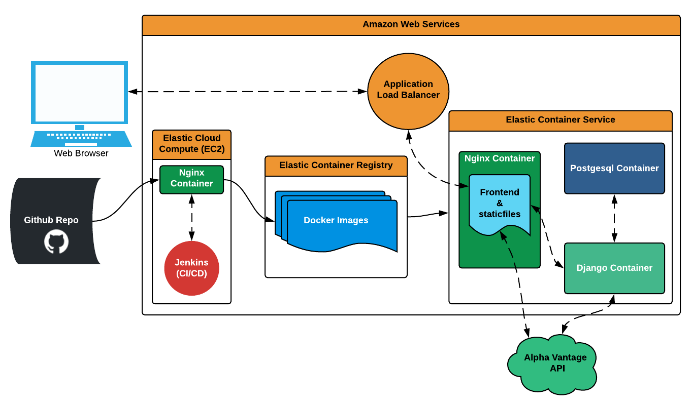

## Technical Details

### React (Frontend & staticfiles)

The React JavaScript framework was chosen for building the user interface for this application. It was selected for its popularity, performance, and abundance of libraries and documentation. Our approach was to compile the front-end to a single-page application (SPA), which would be served by Nginx. The SPA is hydrated client-side, by API requests to either the Django application or to the Alpha Vantage API [1,2].

### Django/Gunicorn

The back-end developed in the Django framework will be served by Gunicorn, a Python WSGI HTTP Server. Gunicorn was chosen as is suitable for handling load well. This is due to its ability to parallelize processes, and its optimisation for speed. One drawback is it's poor ability to serve static files (the React front-end), however Nginx is often used to serve this purpose [3].

### Nginx

Nginx is used as a reverse proxy and load balancer for the Django/Gunicorn server. It also is able to serve static content (the React SPA) without putting any additional load on the Django/Gunicorn application [4].

### Postgresql

Postgresql will be used as a database for the Django application. It has a single port exposed to the Django application container, meaning that it is quite secure and cannot be accessed externally to the Virtual Private Cloud. For more detail on the design of the Postgresql database see the included ER-Diagram.

### Docker

The Nginx server, the Gunicorn server running the Django app, and the Postgresql server are all running each in their own container. This means that the application can be tested locally in an environment almost identical to the production environment (on AWS) [5].

### AWS

The containers will be deployed to AWS. This will also allow us to make use of Amazon Web Services various services such as domain name registration, load balancing services, if we feel later that they are required.

### Jenkins

In order to minimise integration issues, testing issues, code styling and quality, deployment etc., we will be using Jenkins as our Continous Integration pipeline. This too, will be deployed on AWS and will be used to perform automaticated git polling, testing, building with an aim to deployment.

### References

1. [Hydrating on Client vs Server](https://love2dev.com/blog/why-single-page-application-views-should-be-hydrated-on-the-client-not-the-server/)
2. [Alpha Vantage API Documentation](https://www.alphavantage.co/documentation/)
3. [Gunicorn](https://www.fullstackpython.com/green-unicorn-gunicorn.html)
4. [Why nginx is faster than Apache, and why you needn’t necessarily care](https://djangodeployment.com/2016/11/15/why-nginx-is-faster-than-apache-and-why-you-neednt-necessarily-care/)
5. [What is Docker?](https://opensource.com/resources/what-docker)
